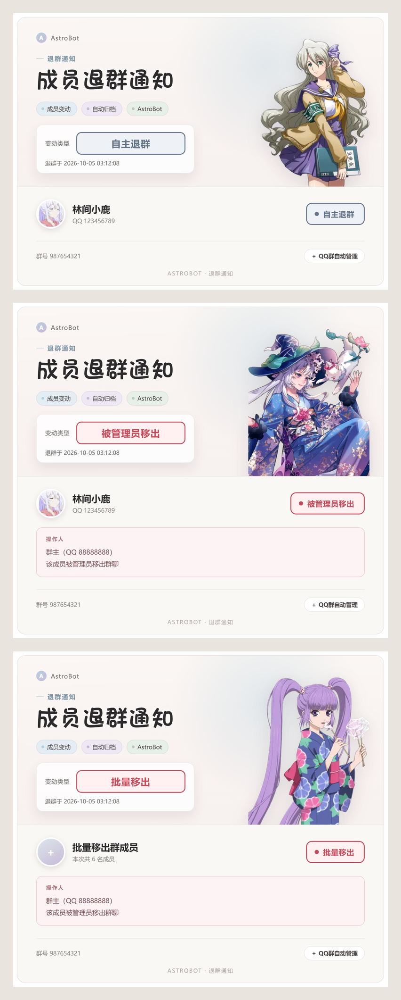
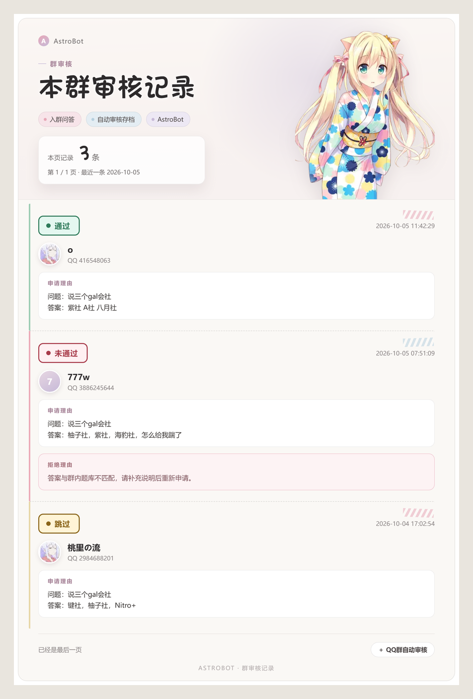

<div align="center">
  <h1>AstrBot QQ群自动审核插件</h1>
  <p>基于 AstrBot + OneBot V11 的智能 QQ 群自动审核插件</p>
  <p>
    <a href="README_CN.md">简体中文</a> · <a href="README_EN.md">English</a>
  </p>
  <p>
    
    
    
    
  </p>
</div>

## 项目介绍

AstrBot QQ群自动审核插件是一款面向 QQ 群管理场景的智能审核插件。

插件基于 OneBot V11 协议监听群申请事件，并结合规则系统、AI
审核以及 Agent 智能工具调用，实现自动化群管理。

## 核心功能

### 1. 自动入群审核

支持：

-   自动同意入群申请
-   自动拒绝入群申请
-   根据审核规则自动判断
-   支持管理员配置审核策略

### 2. AI 自动审核验证答案

插件支持使用 AI 分析用户填写的入群验证内容。

技术点

* 获得群昵称
* 获得群公告历史第一条和最新一条
* AI 根据群昵称, 群公告, 问题和回答的答案综合考虑是否同意申请
* 群画像按群名称和公告内容缓存，公告变化后自动更新
* 相同的入群申请在缓存有效期内不会重复调用 AI

AI 调用做了三层控制，避免重复消耗 Token：

-   **缓存键包含申请者身份**：缓存键由群号、申请者 QQ、申请标识（flag）、群画像、验证问题、申请者答案共同哈希得到，不同申请者即使答案完全相同也不会互相复用结果。
-   **并发合并**：同一份申请在短时间内重复到达时，只允许一个请求真正发出，其余请求等待并复用同一个结果，因此不会出现两个重复请求同时穿透缓存。
-   **缓存有过期时间和数量上限**：默认 600 秒过期、最多 256 条；超期条目会被删除而不是继续命中，AI 返回失败时不写入缓存，避免把临时错误固化。

例如：

用户申请：

    问题：为什么加入本群？
    回答：喜欢学习计算机技术

AI 可以根据群规则判断是否符合要求。

支持：

-   自然语言理解
-   验证答案分析
-   智能审核建议

### 3. 审核记录

插件会保存每个群的入群申请审核记录，包括申请者昵称、QQ、申请理由、审核状态、拒绝理由和时间。

-   使用 `/验证 记录` 查看第 1 页
-   使用 `/验证 记录 <页码>` 查看指定页
-   每页最多显示 5 条记录
-   达到记录上限后自动删除最早的记录
-   普通群成员也可以查看本群记录
-   也可以通过 Agent 使用自然语言查询审核记录

记录上限可以在插件配置中修改，默认每个群保存 5 条；设置为 0 时不保存新记录。

### 4. 图片消息示例

入群审核、退群通知和审核记录都会渲染成图片发送到群内。如果图片渲染服务暂时不可用，插件会自动回退为文字消息。

#### 入群审核

检测到入群申请后，插件会将申请信息渲染为图片发送到群内，包含申请者真实 QQ 头像、昵称与 QQ、申请理由、申请时间和审核状态，未通过时额外显示拒绝理由。

审核状态使用不同颜色展示：通过为绿色、未通过为红色、跳过为黄色。


#### 退群通知

自主退群、被管理员移出和批量移出共用一套模板：被管理员移出时展示操作人，批量移出时展示本批人数。



#### 审核记录

`/验证 记录` 的图片模式，按页展示本群审核历史，每条记录带状态标签，未通过的记录会显示拒绝理由。



#### 卡片高度与白边

卡片高度由内容决定：通过、未通过、跳过、单人退群、被踢出群、批量移出和审核记录各自按实际内容渲染，没有拒绝理由时拒绝理由区域会被完全移除，不会留下空白高度。

图片白边的处理方式：

-   渲染页面的 `body` 保留固定内边距，保证卡片四周始终有可裁剪的余量
-   裁剪时只按**完全不透明**的像素定位卡片边界，忽略抗锯齿和阴影等半透明像素
-   卡片四周统一保留 16 像素装饰性白边，四边宽度一致，不会出现某一侧特别宽
-   不再使用固定的 viewport 高度撑大图片，也不再给卡片加外阴影

### 5. 插件配置界面

提供插件配置功能：

支持：

-   设置默认最低等级
-   设置默认是否开启等级限制
-   AI 审核失败后的动作 --> Skip/Reject
-   自定义拒绝理由长度
-   AI 审核缓存有效期（`ai_cache_ttl`，默认 600 秒）
-   AI 审核缓存条数上限（`ai_cache_max`，默认 256）
-   群画像送入模型的最大长度（`profile_max_chars`，默认 1000）
-   单条群公告的最大长度（`notice_max_chars`，默认 400）
-   Agent 最大执行步数（`agent_max_steps`，默认 3）

### 6. Agent 智能管理

插件集成 Agent 功能。

管理员可以通过自然语言让 AI 调用插件工具完成操作。

例如：

    帮我关闭QQ群 1063462063 的自动审核

Agent 会自动识别需求并调用对应工具。

示例：

    把QQ 123456789加入白名单

Agent 自动：

1.  识别用户需求
2.  调用白名单管理工具
3.  完成添加操作

    查看白名单有哪些用户

Agent 自动调用名单管理工具并返回当前白名单。

### Agent 去重

Agent 事件使用挂在 AstrBot `Context` 上的共享去重状态，因此在多插件实例、热重载或重复注册的情况下依然有效。

-   优先使用消息 ID、消息序列号、`request_id`、`flag` 等原始事件字段作为去重键
-   没有唯一 ID 时，回退到「平台 + 群号 + 发送者 + 消息内容 + 事件时间」生成的备用去重键
-   去重键带 TTL，避免缓存无限增长
-   同一条消息只会触发一次 Agent 和一次工具调用
-   去重键包含发送者和申请标识，因此不同用户发送相同文字、不同踢人事件都不会被误判为同一事件

### Token 优化

-   Agent 的 `max_steps` 默认从 10 降到 3，自然语言调用能力保持不变
-   固定格式的记录查询（如「查看审核记录」）在进入 Agent 之前就被直接处理，不再产生模型调用
-   按调用者身份缩小工具集合：非管理员只携带名单、配置、记录三个查询工具
-   工具已经直接发送图片后，不再要求模型额外生成一段重复说明
-   群公告会先清理重复空格、重复公告和无意义链接，并按长度上限截断

群画像和 AI 验证缓存按群隔离，仅保存在运行内存中；插件不会收集或上传群成员列表。

## 配置

支持多群独立配置：

``` json
{
    "groups": {
        "群号": {
            "REQUEST_CONFIG": true,
            "LEVEL_REQUIRED_CONFIG": true,
            "MIN_LEVEL": 5,
            "BLACKLIST": [],
            "WHITELIST": []
        }
    }
}
```

## 项目结构

    astrbot_plugin_group_auto_approve
    
    ├── main.py
    ├── metadata.yaml
    ├── README.md
    ├── logo.png
    ├── review_example.png
    ├── leave_example.png
    ├── records_example.png
    └── web/

## 安装

进入 AstrBot 插件目录：

``` bash
git clone https://github.com/maruyui-dev/astrbot_plugin_group_auto_approve.git
```

重启 AstrBot 即可。

## 环境要求

-   AstrBot
-   OneBot V11

推荐：

-   NapCat
-   LLOneBot

## License

MIT License

## Supports

- [AstrBot Repo](https://github.com/AstrBotDevs/AstrBot)
- [AstrBot Plugin Development Docs (Chinese)](https://docs.astrbot.app/dev/star/plugin-new.html)
- [AstrBot Plugin Development Docs (English)](https://docs.astrbot.app/en/dev/star/plugin-new.html)
