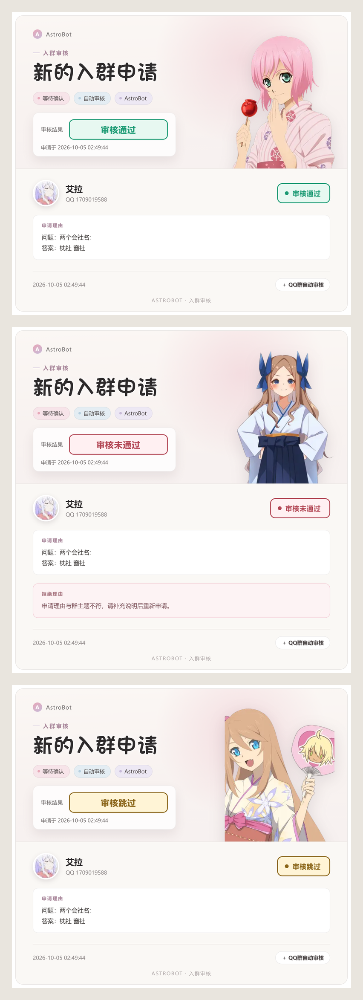

<div align="center">
  <h1>AstrBot QQ Group Auto Approval Plugin</h1>
  <p>An intelligent QQ group automatic approval plugin based on AstrBot and OneBot V11.</p>
  <p>
    <a href="README_CN.md">简体中文</a> · <a href="README_EN.md">English</a>
  </p>
  <p>
    
    
    
    
  </p>
</div>

## Introduction

AstrBot QQ Group Auto Approval Plugin is an intelligent moderation plugin designed for QQ group management.

The plugin listens for group join request events through the OneBot V11 protocol and combines a rule system, AI-powered review, and Agent-based intelligent tool calling to automate group management.

## Core Features

### 1. Automatic Group Join Review

The plugin supports:

- Automatically approving group join requests
- Automatically rejecting group join requests
- Automatically determining results according to review rules
- Administrator-configured review strategies

### 2. AI-Powered Verification Answer Review

The plugin uses AI to analyze the verification information submitted by users when joining a group.

Technical details:

- Retrieves the applicant's group nickname
- Retrieves the first and latest group announcements
- Uses the group nickname, announcements, verification question, and answer to determine whether the application should be approved

Example:

```text
Question: Why do you want to join this group?
Answer: I enjoy learning computer technology.
```

The AI can determine whether the answer meets the group's requirements based on the configured rules.

Supports:

- Natural language understanding
- Verification answer analysis
- Intelligent review suggestions

### 3. Review History

The plugin stores per-group application review records, including the applicant's nickname, QQ ID, application reason, review status, rejection reason, and time.

- Use `/验证 记录` to view page 1.
- Use `/验证 记录 <page>` to view a specific page.
- Each page contains up to 5 records.
- The oldest record is removed automatically when the configured limit is reached.
- Group members can view records, and the Agent can query them using natural language.

### 4. Image Review Notifications

When a group join request is detected, the plugin renders the application as an image and sends it to the group.

The image includes the applicant's QQ avatar, nickname, QQ ID, application reason, request time, review status, and rejection reason when applicable. Passed reviews use green, rejected reviews use red, and skipped reviews use yellow.

If image rendering is unavailable, the plugin automatically falls back to a text message.



### 5. Plugin Configuration Interface

The plugin provides configuration options for:

- Setting the default minimum user level
- Setting whether level restrictions are enabled by default
- Configuring the action taken when AI review fails: `Skip` or `Reject`
- Customizing the maximum length of rejection reasons

### 6. Agent-Based Intelligent Management

The plugin integrates Agent functionality.

Administrators can use natural language commands and let the AI call plugin tools to perform management operations.

For example:

```text
Disable automatic review for QQ group 1063462063.
```

The Agent automatically understands the request and calls the corresponding tool.

Another example:

```text
Show today's group join requests.
```

The Agent will automatically:

1. Call the review-record query tool
2. Retrieve the day's application data
3. Return a summary of the results

```text
Add QQ user 123456789 to the whitelist.
```

The Agent will automatically:

1. Identify the requested operation
2. Call the whitelist management tool
3. Complete the update

```text
Show the users currently on the whitelist.
```

The Agent automatically calls the list management tools and returns the current whitelist.

## Configuration

The plugin supports independent configuration for multiple QQ groups:

```json
{
    "groups": {
        "group_id": {
            "REQUEST_CONFIG": true,
            "LEVEL_REQUIRED_CONFIG": true,
            "MIN_LEVEL": 5,
            "BLACKLIST": [],
            "WHITELIST": []
        }
    }
}
```

## Project Structure

```text
astrbot_plugin_group_auto_approve

├── main.py
├── metadata.yaml
├── README.md
├── logo.png
├── review_example.png
└── web/
```

## Installation

Enter the AstrBot plugin directory and run:

```bash
git clone https://github.com/maruyui-dev/astrbot_plugin_group_auto_approve.git
```

Restart AstrBot after installation.

## Requirements

- AstrBot
- OneBot V11

Recommended:

- NapCat
- LLOneBot

## License

MIT License

## Supports

- [AstrBot Repository](https://github.com/AstrBotDevs/AstrBot)
- [AstrBot Plugin Development Documentation (Chinese)](https://docs.astrbot.app/dev/star/plugin-new.html)
- [AstrBot Plugin Development Documentation (English)](https://docs.astrbot.app/en/dev/star/plugin-new.html)
